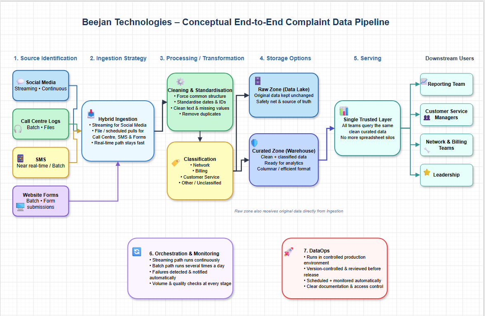

# Beejan Technologies – Conceptual End-to-End Complaint Data Pipeline

> **Data Engineering Fundamentals Assignment**  
> Conceptual design only • No tools mentioned

---

## Overview

Beejan Technologies receives thousands of customer complaints every day through social media, call centre logs, SMS, and website forms. These complaints cover network problems, incorrect billing, and poor customer service. 

Right now the data lives in different formats, teams work in silos, and reports are put together manually. The result is delay, inconsistency, and frustration. 

This document describes a **conceptual end-to-end data pipeline** that brings all the complaint data together, cleans it, classifies it, and makes it ready for the whole company to use.

---

## Architecture Diagram

*Hybrid pipeline: continuous streaming for social media + batch processing for the other sources. All paths converge in a single trusted curated layer.*

---

## 1. Design Choices

The goal of this pipeline is simple: take customer complaints from four very different channels and turn them into one clean, trustworthy, and usable source of truth that the whole company can rely on.

The pipeline is designed in clear stages:

### Landing / Raw Zone
Every source lands here first, exactly as it arrives. Nothing is changed. This protects the original data and gives us a place to go back to if something goes wrong later.

### Cleaning & Standardisation
All records are forced into the same structure. Dates, customer identifiers, and text are cleaned and made consistent. Duplicates are removed. Missing values are handled the same way every time.

### Classification
Each complaint is labelled into one of three business categories (**Network**, **Billing**, **Customer Service**) or marked as “Other”. This turns messy free text into something the business can actually count and act on.

### Curated / Serving Zone
Only the clean, classified data lives here. This is the single place that reporting teams, managers, and leadership will query. Because everything is already standardised, they no longer need to fight with different formats or dig through old spreadsheets.

The pipeline is deliberately **hybrid**. Social media complaints flow continuously so the company can react quickly. The other three sources move in batches several times a day. Keeping the two paths separate until the curated layer avoids slowing down the real-time data while still producing a combined view.

---

## 2. Assumptions

Several practical assumptions sit underneath this design:

- Every complaint, no matter the channel, can be linked to a customer somehow (phone number, account ID, or email).
- The three main complaint categories (Network, Billing, Customer Service) cover the large majority of cases. Anything that does not fit cleanly goes into an “Other” bucket.
- Business users are happy to work from one trusted curated layer instead of each team keeping its own version of the truth.
- Slight delay on the batch sources (1–2 hours) is acceptable as long as social media complaints are near real-time.
- The volume of data is manageable and will not suddenly explode without warning.

---

## 3. Challenges and Unknowns

### Different data quality
Call centre logs and website forms are usually structured. Social media posts and SMS messages are messy free text full of slang, abbreviations, and emotion. Making these look the same is the hardest technical part of the design.

### Classification accuracy
Simple keyword rules will catch the obvious cases, but many complaints are vague or use everyday language that is hard to categorise automatically. A clear process for reviewing and improving the labels over time will be needed.

### Duplicate complaints
The same customer often raises the same issue on more than one channel. Detecting and merging these without losing important details or double-counting is not straightforward.

### Real-time vs batch balance
Streaming data must not be held up waiting for slower sources, yet the business still wants a combined picture. The design keeps the paths separate until the curated layer, but the exact timing of that join will need careful thought.

### Ownership and trust
Different teams currently own their own data and their own reports. Moving to one central pipeline means they have to trust a new process. Clear documentation, early involvement, and visible improvements in report speed will be important for adoption.

---

## 4. Additional Notes

This design deliberately separates raw data from clean data. That separation is the foundation of trust. If anyone ever questions a number in a report, it is always possible to go back to the original complaint and show exactly what happened.

The pipeline is also built so that new sources can be added later without redesigning everything. Once the common structure and classification logic exist, a fifth or sixth channel can plug in relatively easily.

---

## Conclusion

By the end of this conceptual pipeline, Beejan Technologies will no longer rely on people copying data into spreadsheets or waiting days for reports. Instead, every team will pull from the same clean, classified, and timely source of customer pain points. 

The design protects the original data, turns messy complaints into structured insight, and creates a single place the whole company can trust. That is the foundation the actual pipeline can be built on.

---
---

---
# Detailed Design Notes  
*(Answers to the 7 Guiding Questions)*

---

### 1. Source Identification

**What are the data sources?**

There are four clear sources of customer complaints:

- Social media posts (especially public mentions and direct messages on Twitter/X)
- Call centre log files
- SMS messages sent by customers
- Website form submissions

**What formats and frequency (batch or streaming or both)?**

| Source              | Frequency                          |
|---------------------|------------------------------------|
| Social media        | Mostly real-time / streaming       |
| Call centre logs    | Batch (files dropped 1–few times/day) |
| SMS                 | Near real-time or small batches    |
| Website forms       | Batch / micro-batch                |

Overall we are dealing with a **hybrid** situation: one clear streaming source + three mostly batch sources.

---

### 2. Ingestion Strategy

**Will you use API ingestion, file uploads, or streaming?**

We need a mixed approach:

- Social media → continuous streaming ingestion so we catch complaints as they happen
- Call centre logs → file-based ingestion (files land in a landing zone)
- SMS and website forms → either small file drops or API-style pulls on a schedule

**How will real-time data (e.g. Twitter) be handled?**

Real-time social media data will be ingested continuously into a temporary holding area. From there it can either:

- stay in a streaming path for immediate alerting, or
- be micro-batched and joined with the other sources later in the pipeline.

This way we don’t lose the “live” nature of Twitter complaints while still being able to combine them with the slower sources.

---

### 3. Processing / Transformation

**How will you clean and standardize the data?**

Every source will go through the same cleaning steps:

- Remove empty or incomplete records
- Standardise date and time formats
- Standardise customer identifiers (phone number, account ID, etc.)
- Clean text (remove extra spaces, special characters, emojis where needed)
- Handle missing values consistently
- Deduplicate (same complaint arriving from two channels)

After cleaning, all data is forced into one common structure so every complaint looks the same no matter where it came from.

**How will you classify complaints into categories?**

We will classify each complaint into one of the three main categories the business cares about:

- Network issues
- Billing issues
- Customer service issues

This can be done with a combination of keyword rules (for obvious cases) and simple text classification logic based on the content of the complaint. We also keep an “Other / Unclassified” bucket so nothing is forced into the wrong category.

---

### 4. Storage Options

**Do you need a data lake? A warehouse? Both?**

Yes — both.

- A **data lake** (or landing + raw zone) to store the original data exactly as it arrived. This is our safety net and source of truth.
- A **data warehouse** (or curated zone) where the cleaned, standardised, and classified data lives in a form that is easy to query.

**What format will the cleaned data be stored in?**

Cleaned data should be stored in a columnar format that is efficient for analytics.  
Raw data can stay in its original format (JSON, CSV, text logs, etc.) so we never lose the original message.

---

### 5. Serving

**How will the data be queried?**

Once the data is cleaned and stored in the curated layer, it can be queried with normal analytical queries (filters, aggregations, time-based analysis, etc.).

**How will the downstream users use this data?**

- **Reporting team** → daily/weekly dashboards and delayed reports become near real-time or same-day reports
- **Customer service managers** → see volume and trends of each complaint type
- **Network and billing teams** → get alerts or summaries of the issues that belong to them
- **Leadership** → high-level view of customer pain points

Everyone pulls from the same clean, trusted layer instead of each team maintaining their own spreadsheet.

---

### 6. Orchestration & Monitoring

**How often will this pipeline run?**

- Streaming path for social media → continuous
- Batch path for the other sources → several times a day (for example every 1–2 hours) so reports stay fresh without being overly expensive

**How will failures be detected or notified?**

We need basic monitoring on every stage:

- Did the data arrive?
- Did the cleaning step succeed?
- Did the classification step succeed?
- Did the data land in the final storage?

If any step fails or data volume drops unexpectedly, an alert is raised so the data team can fix it quickly.

---

### 7. DataOps

**Where will the pipeline run?**

The pipeline will run in a controlled production environment that is separate from any experimental or development work. This keeps things stable and secure.

**How will you make it available in production?**

- The pipeline is version-controlled
- Changes go through a simple review process
- It is scheduled and monitored automatically
- Access to the final clean data is given only to the people who need it
- Documentation of the data (what each field means) is kept up to date so new users can understand it quickly

---

*This is a conceptual design only. No specific tools or technologies have been named, as required by the assignment.*
